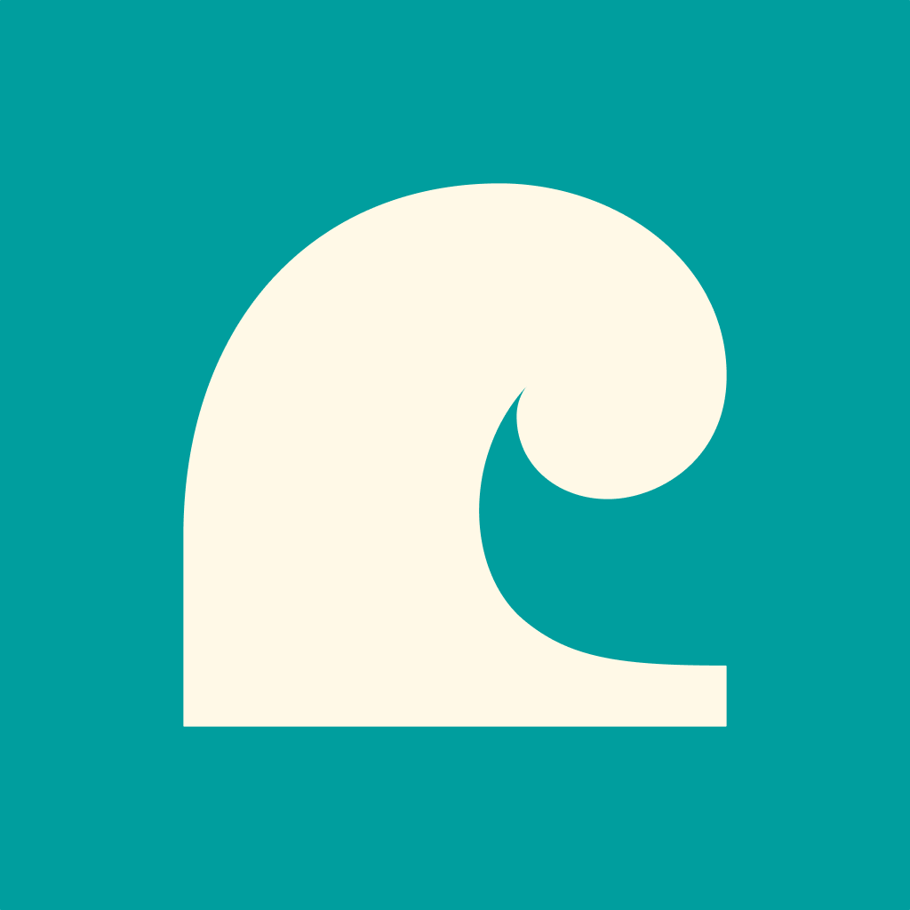

<p align="center">
  
</p>

<h1 align="center">Surf API SDKs</h1>

<p align="center">
  Official client libraries for the <a href="https://surf.social">Surf</a> social platform API.<br>
  <a href="https://developers.surf.social/devportal/v1/api-docs">API Reference</a> &middot;
  <a href="https://developers.surf.social/devportal/v1/getting-started">Getting Started</a> &middot;
  <a href="https://developers.surf.social/devportal/v1/community">Community</a>
</p>

---

## SDKs

| Language | Path | Version | Requirements |
|----------|------|---------|--------------|
| [Python](python/) | `python/` | 1.0.0 | Python 3.8+ |
| [TypeScript](typescript/) | `typescript/` | 1.0.0 | Node.js 18+ |
| [Go](go/) | `go/` | 1.0.0 | Go 1.21+ |
| [Java](java/) | `java/` | 1.0.0 | Java 17+ |

## Quick Start

### 1. Get an API Token

[Apply for developer access](https://developers.surf.social/devportal/v1/developer/apply), create an application, and generate an API token.

### 2. Install an SDK

```bash
# Python
cd python && pip install -e .

# TypeScript
cd typescript && npm install && npm run build

# Go
go get github.com/Flipboard/surf-sdks/go

# Java
cd java && ./gradlew jar
```

### 3. Make Your First Request

```python
from surf_api import SurfClient

client = SurfClient("surf_sk_live_your_token_here")
feed = client.feeds.get("surf/topic/technology")
print(feed["title"])
```

```typescript
import { SurfClient } from './src';
const client = new SurfClient({ apiKey: 'surf_sk_live_...' });
const feed = await client.feeds.get('surf/topic/technology');
```

```go
client := surf.NewClient("surf_sk_live_...")
feed, _ := client.Feeds.Get("surf/topic/technology")
```

```java
SurfClient client = new SurfClient("surf_sk_live_...");
Feed feed = client.feeds.get("surf/topic/technology");
```

## What You Can Do

| Category | Description |
|----------|-------------|
| **Feeds** | Browse topic feeds, trending posts, timelines across Mastodon, Bluesky, and RSS |
| **Search** | Full-text search for feeds, posts, accounts, and podcasts |
| **Custom Feeds** | Create personalized feeds from topics, hashtags, accounts, and RSS sources |
| **AI** | Ask questions about feeds, generate summaries, build feeds from natural language |
| **Content** | Resolve URLs, extract articles, detect language, analyze images |
| **Audio** | Text-to-speech, radio stations, podcasts, daily briefings |
| **Write** | Post, favourite, boost, bookmark -- target Bluesky or Mastodon with `?service=` |
| **MCP** | Model Context Protocol integration for Claude and AI agents |

83 endpoints across 13 categories. Full details in the [API Reference](https://developers.surf.social/devportal/v1/api-docs).

## Authentication

| Method | Token Format | Use Case |
|--------|-------------|----------|
| API Token | `surf_sk_live_*` | Server-to-server, bots, data access |
| OAuth 2.0 | `surf_at_*` | Acting on behalf of a user (PKCE required) |

All SDKs include OAuth helpers for PKCE flow.

## MCP Integration

The Surf API is available as an [MCP server](https://modelcontextprotocol.io) for Claude Code and other AI agents:

```
MCP Server URL: https://mcp.surf.social/mcp
```

## Testing

Each SDK has integration tests that run against the live API:

```bash
# Run all SDK tests
SURF_API_TEST_TOKEN=surf_sk_live_... ./test-harness/run_all.sh

# Or run individually
cd python && pytest tests/ -v
cd typescript && npm run test:integration
cd go && go test -tags integration -v
cd java && ./gradlew integrationTest
```

## Contributing

We welcome contributions! Please see [CONTRIBUTING.md](CONTRIBUTING.md) for guidelines.

- **Bug reports**: [Open an issue](https://github.com/Flipboard/surf-sdks/issues)
- **Feature requests**: [Open an issue](https://github.com/Flipboard/surf-sdks/issues) with the `enhancement` label
- **Pull requests**: Fork, create a branch, submit a PR

## License

[MIT](LICENSE)

## Links

- [Surf](https://surf.social)
- [Developer Portal](https://developers.surf.social)
- [API Reference](https://developers.surf.social/devportal/v1/api-docs)
- [Status Page](https://surf.social/devportal/v1/status/page)
- [Discord](https://discord.gg/R4E9frvzcn)
- [Support](mailto:support@surf.social)
